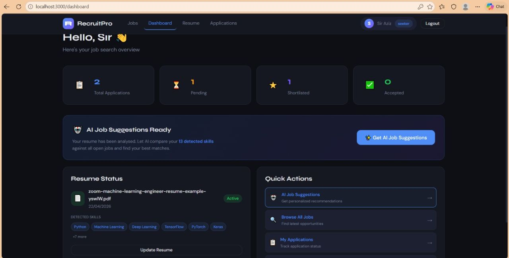
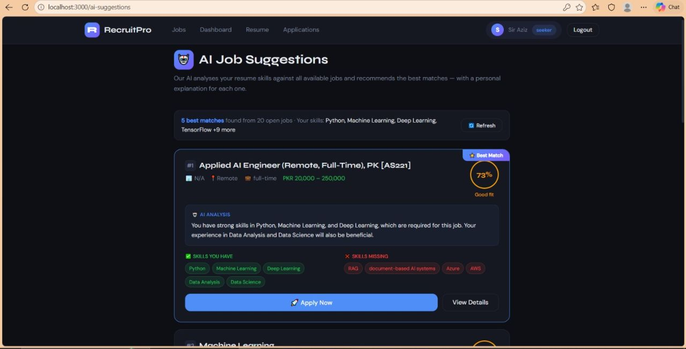
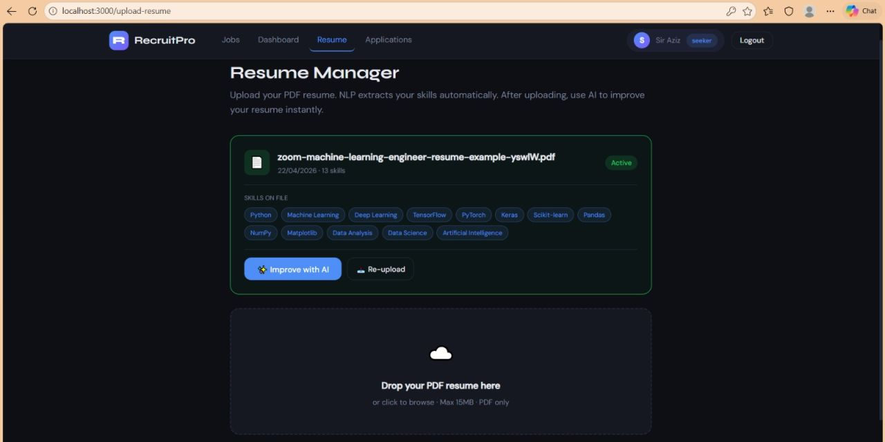
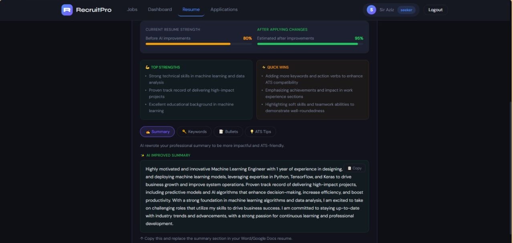
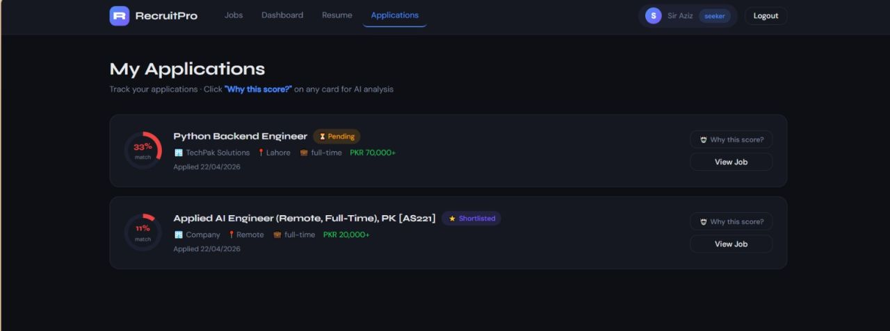
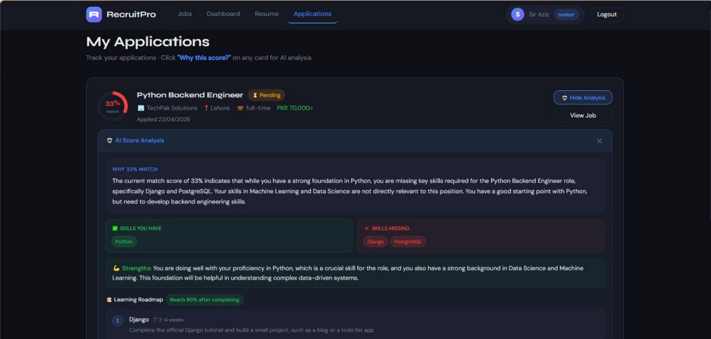
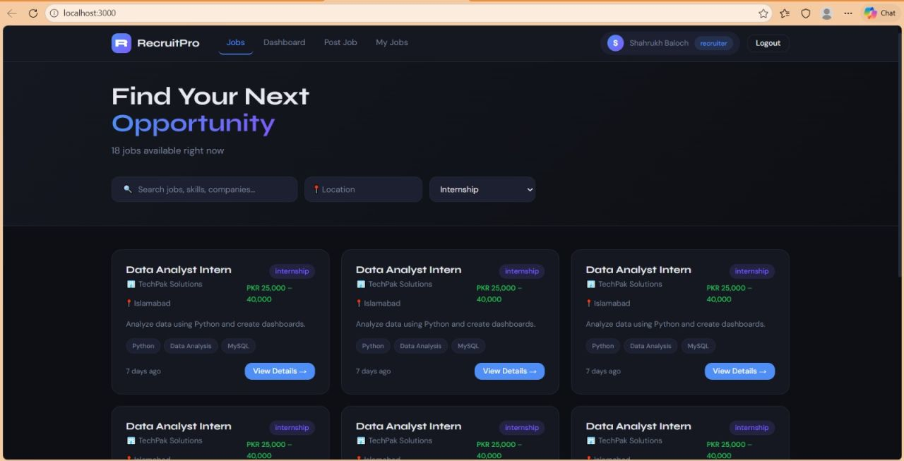
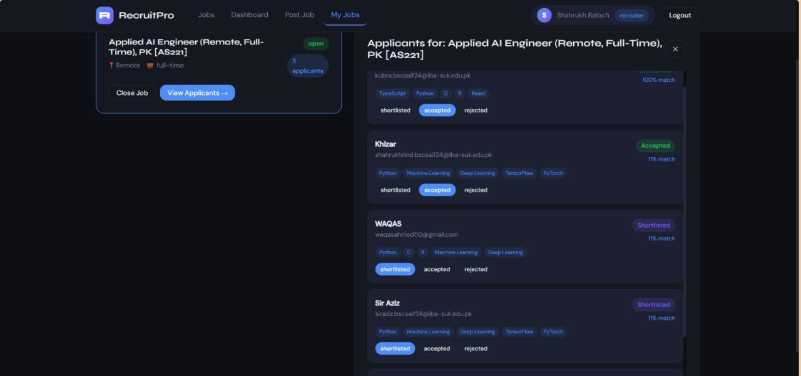

<div align="center">

<h1>⚡ TalentFlow</h1>

<p><strong>End-to-end AI recruitment platform — resume screening, JD parsing, candidate matching & intelligent scoring for recruiters and job seekers.</strong></p>

<p>
  <a href="https://github.com/Shahrukh-aidev/Talent-Flow/stargazers"></a>
  <a href="https://github.com/Shahrukh-aidev/Talent-Flow/network/members"></a>
  <a href="https://github.com/Shahrukh-aidev/Talent-Flow/issues"></a>
  
  
  
</p>

<p>
  <a href="#-features">Features</a> •
  <a href="#-tech-stack">Tech Stack</a> •
  <a href="#-getting-started">Getting Started</a> •
  <a href="#-architecture">Architecture</a> •
  <a href="#-screenshots">Screenshots</a> •
  <a href="#-contributing">Contributing</a>
</p>

</div>

---

## 🧠 What is TalentFlow?

**TalentFlow** is a full-cycle AI-powered recruitment platform designed to eliminate the friction from modern hiring. It serves both **recruiters** who need to find the right candidate fast, and **job seekers** who want their profile matched to the right opportunities — intelligently, not just keyword-by-keyword.

From uploading a resume to receiving an AI-generated match score with detailed reasoning, the entire pipeline is automated, intelligent, and explainable.

> Built by [Shahrukh Baloch](https://github.com/Shahrukh-aidev) — AI/ML Developer & CS Student at Sukkur IBA University 🇵🇰

---

## ✨ Features

### 🔍 For Recruiters
- **Candidate Matching Engine** — Rank applicants by AI-generated match score with full skill breakdown
- **Applicant Management** — Shortlist, accept, or reject candidates directly from the dashboard
- **Job Posting** — Post jobs with required skills, salary range, location, and type
- **My Jobs Dashboard** — Track all posted jobs and applicant counts in one place
- **Intelligent Scoring** — Candidates scored on skills fit, experience relevance, and education alignment

### 👤 For Job Seekers
- **AI Resume Enhancer** — Upload your PDF resume; NLP extracts 13+ skills automatically, then Groq AI rewrites your summary, adds ATS keywords, and improves bullet points
- **Smart Job Matching** — Get AI-ranked job suggestions with match percentage and "why this score" explanation
- **Resume Strength Meter** — See your current resume score (e.g. 80%) vs estimated after AI improvements (95%)
- **Application Tracking** — Track every application with live status: Pending → Shortlisted → Accepted
- **AI Score Analysis** — Click "Why this score?" on any application to get a full skill gap breakdown + learning roadmap

### ⚙️ Platform
- Dual role system: Recruiter & Job Seeker with separate dashboards
- Secure JWT-based authentication
- RESTful API backend
- Pakistani job market focus (PKR salaries, local companies)

---

## 🛠 Tech Stack

### Backend
| Layer | Technology |
|-------|-----------|
| Runtime | Node.js |
| Framework | Express.js |
| AI / LLM | Groq AI |
| NLP | Custom NLP Parser |
| Database | MongoDB + MySQL |
| Auth | JWT |

### Frontend
| Layer | Technology |
|-------|-----------|
| Framework | React.js |
| HTTP Client | Axios |
| Routing | React Router |
| Styling | CSS Modules |

---

## 🏗 Architecture

```
                    ┌──────────────────────────────┐
                    │         React Frontend         │
                    │   (Recruiter / Job Seeker UI)  │
                    └──────────────┬───────────────┘
                                   │ REST API (JWT Auth)
                    ┌──────────────▼───────────────┐
                    │       Node.js + Express        │
                    │  ┌─────────────────────────┐  │
                    │  │  NLP Resume Parser      │  │
                    │  │  AI Matching Engine     │  │
                    │  │  Groq Resume Enhancer   │  │
                    │  │  Scoring Module         │  │
                    │  └───────────┬─────────────┘  │
                    └──────────────┼────────────────┘
               ┌──────────────────┼──────────────┐
               ▼                  ▼              ▼
         ┌──────────┐      ┌───────────┐  ┌──────────────┐
         │ MongoDB  │      │   MySQL   │  │   Groq AI    │
         │(Profiles)│      │  (Schema) │  │  (LLM Core)  │
         └──────────┘      └───────────┘  └──────────────┘
```

---

## 🚀 Getting Started

### Prerequisites
- Node.js 18+
- MongoDB instance
- MySQL instance
- Groq API key

### 1. Clone the repo
```bash
git clone https://github.com/Shahrukh-aidev/Talent-Flow.git
cd Talent-Flow
```

### 2. Backend Setup
```bash
cd backend
npm install

# Create .env file and add your keys
cp .env.example .env

npm start
```

### 3. Frontend Setup
```bash
cd frontend
npm install
npm start
```

### 4. Environment Variables

**Backend `.env`**
```env
GROQ_API_KEY=your_groq_key
MONGODB_URI=your_mongodb_uri
MYSQL_HOST=localhost
MYSQL_USER=your_user
MYSQL_PASSWORD=your_password
MYSQL_DATABASE=talentflow
JWT_SECRET=your_jwt_secret
PORT=5000
```

---

## 📸 Screenshots

### 👤 Job Seeker View

| Dashboard | AI Job Suggestions |
|---|---|
|  |  |

| Resume Manager | AI Resume Enhancer |
|---|---|
|  |  |

| My Applications | AI Score Analysis |
|---|---|
|  |  |

### 🔍 Recruiter View

| Jobs Listing | Applicant Management |
|---|---|
|  |  |

---

## 📁 Project Structure

```
Talent-Flow/
├── backend/
│   ├── server.js
│   ├── config/
│   │   ├── aiClient.js
│   │   ├── mongodb.js
│   │   └── mysql.js
│   ├── middleware/
│   │   └── auth.js
│   ├── models/
│   │   └── Resume.js
│   ├── routes/
│   │   ├── ai.js
│   │   ├── applications.js
│   │   ├── auth.js
│   │   ├── companies.js
│   │   ├── jobs.js
│   │   └── resume.js
│   └── utils/
│       └── nlpParser.js
├── database/
│   └── mysql_schema.sql
├── frontend/
│   ├── public/
│   └── src/
│       ├── pages/
│       ├── components/
│       ├── context/
│       └── api/
├── ScreenShots/
└── README.md
```

---

## 🤝 Contributing

Contributions are welcome! Feel free to open an issue or submit a pull request.

```bash
git checkout -b feature/your-feature-name
git commit -m "feat: add your feature"
git push origin feature/your-feature-name
```

---

## 👨‍💻 Author

**Shahrukh Baloch** — AI/ML Developer
- GitHub: [@Shahrukh-aidev](https://github.com/Shahrukh-aidev)
- LinkedIn: [shahrukh-baloch](https://www.linkedin.com/in/shahrukh-baloch/)
- Fiverr: [jsharukh123](https://www.fiverr.com/users/jsharukh123/)

---

## 📄 License

This project is licensed under the MIT License — see the [LICENSE](LICENSE) file for details.

---

<div align="center">
  <p>If you found this useful, please ⭐ the repo — it helps a lot!</p>
  <p>Built with ❤️ in Pakistan 🇵🇰</p>
</div>